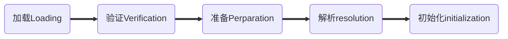

# java的类加载机制

虚拟机把描述类的数据从class文件加载到内存中,并对数据进行校验,转换解析和初始化,最终形成可以被虚拟机直接使用的java类型.这个机制就是java的类加载机制.

## 触发类加载的时机
虚拟机有且只有如下几种情况会触发Java的类加载:
1. 遇到new, getstatic, putstatic 或者 invokestatic 这4条指令时,如果类没有进行初始化,则需要先触发其初始化.
2. 使用java.lang.reflect包方法对类进行反射调用的时候,如果类没有进行初始化,则需要先触发初始化.
3. 当一个初始化一个类的时候,发现其父类没有被初始化过,则需要先触发父类的初始化.
4. 当虚拟机启动时,用户需要指定一个执行的主类,虚拟机会先初始化这个主类.
5. Java 1.7添加了一个MethodHandle实例解析结果为getStatic,putStatic和invokestatic的方法句柄,如果方法句柄对应的类还没进行初始化,则需要先触发对其初始化.

以上是有且仅有的类初始化的触发场景.其他类型均不能触发类的初始化.如以下几种情况都不会触发类的初始化
- 一个类引用了另一个类的常量.(常量是编译期直接替换为常量本身的字面值了. 如果是常量对象,会触发这个对象所属类的初始化,因为存在new指令)
- 方法入参的时候,或者方法的字节指令里面引用到某个类的情况.这种情况,只有调用的时候才会被初始化,他们引用要么别的方法调用传过来,要么自己调用. 自然也符合上面的情况.
- 创建数组类型,初始化该类型的数组是,不会触发这个类的初始化.

## 类加载的过程

