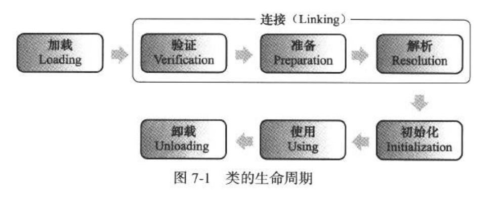

# java的类加载机制

虚拟机把描述类的数据从class文件加载到内存中,并对数据进行校验,转换解析和初始化,最终形成可以被虚拟机直接使用的java类型.这个机制就是java的类加载机制.

##1. 触发类加载的时机
虚拟机有且只有如下几种情况会触发Java的类加载:
1. 遇到new, getstatic, putstatic 或者 invokestatic 这4条指令时,如果类没有进行初始化,则需要先触发其初始化.
2. 使用java.lang.reflect包方法对类进行反射调用的时候,如果类没有进行初始化,则需要先触发初始化.
3. 当一个初始化一个类的时候,发现其父类没有被初始化过,则需要先触发父类的初始化.
4. 当虚拟机启动时,用户需要指定一个执行的主类,虚拟机会先初始化这个主类.
5. Java 1.7添加了一个MethodHandle实例解析结果为getStatic,putStatic和invokestatic的方法句柄,如果方法句柄对应的类还没进行初始化,则需要先触发对其初始化.

以上是有且仅有的类初始化的触发场景.其他类型均不能触发类的初始化.如以下几种情况都不会触发类的初始化
- 一个类引用了另一个类的常量.(常量是编译期直接替换为常量本身的字面值了. 如果是常量对象,会触发这个对象所属类的初始化,因为存在new指令)
- 方法入参的时候,或者方法的字节指令里面引用到某个类的情况.这种情况,只有调用的时候才会被初始化,他们引用要么别的方法调用传过来,要么自己调用. 自然也符合上面的情况.
- 创建数组类型,初始化该类型的数组是,不会触发这个类的初始化.

##2. 类加载的过程

类加载的过程主要分为如下几个步骤: 加载,验证,准备,解析,初始化,使用,卸载.

### 2.1 加载
加载是将二进制数据加载到虚拟机中,并生成一个对虚拟机可用的class对象入口的过程.主要是通过虚拟机的ClassLoader对二进制数据进行查找并加载.如果没有发现需要加载的类,会抛出ClassNotFoundException.

### 2.2 验证
验证阶段是对class文件合法性的验证.验证主要分为三种类型:文件格式验证,元数据验证和字节码验证.

文件格式验证包括以下内容:
- 文件是不是以0xCAFEBABE开头,表示一个合法的class文件
- 文件的主版本号和次版本号是不是虚拟机所支持的.
- 常量池的常量是否有不被支持的常量类型
- 常量池的各种索引值是否指向不存在的常量或者不符合类型的常量
- CONSTANT_utf8_info型常量是否有不符合utf8编码的数据
- class文件中各部分以及本间本身是否被删除或者附加其他信息

元数据验证:
- 这个类是否存在父类以及父类是否被初始化
- 这个类的父类是否被final修饰的
- 有没有覆写被父类中被final修饰的方法
- 有没有实现接口或者继承抽象类但没有实现其中的抽象方法.
- 子类和父类是否存在矛盾,如覆写方法但修饰符更小等.

字节码校验:
- 校验字节指令和其操作的数据类型保持一致
- 保证跳转指令不会跳转到方法体之外的字节码上
- 保证方法中类型转换是有效的.

以上是验证的主要行为.包括但不限于.

### 2.3 准备
创建类或接口的静态字段,并用默认值初始化这些字段. 这个阶段不执行任何的虚拟机指令. 如果是常量,即static final修饰的,就会在准备时期对该字段进行赋值.

### 2.4 解析
解析是将常量池中符号引用解析为直接引用的过程.主要分为三种类型:类或接口解析,字段解析和方法解析.

类或接口解析:如果当前代码所处的类中存在一个从未解析过的符号引用d,会将其解析成一个直接引用C.
字段解析:

### 2.5 初始化

## 3. 类加载器